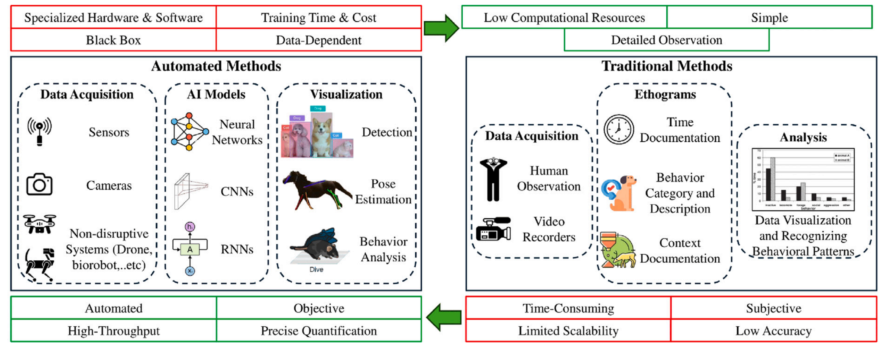

<h1 align="center">
  <br>
  Beyond observation: Deep learning for animal behavior and ecological conservation deep learning for animal behavior and ecological conservation

</h1>


<div align="center">
  <a href="https://scholar.google.com/schhp?hl=en">Lyes Saad Saoud</a> &nbsp;•&nbsp;
  <a href="https://scholar.google.com/schhp?hl=en">Atif Sultan</a> &nbsp;•&nbsp;
  <a href="https://scholar.google.com/schhp?hl=en">Mahmoud Elmezain</a> &nbsp;•&nbsp;
  <a href="https://scholar.google.com/schhp?hl=en">Mohamed Heshmat</a> &nbsp;•&nbsp;
  <br/>
  <a href="https://scholar.google.com/schhp?hl=en">Lakmal Seneviratne</a> &nbsp;•&nbsp;
  <a href="https://scholar.google.com/citations?user=bCC3kdUAAAAJ&hl=en">Irfan Hussain</a> &nbsp;•&nbsp;
  <br/>
</div>

<h4 align="center">
  <a href="https://doi.org/10.1016/j.ecoinf.2024.102893/"><b>Paper</b></a>
</h4>

<div align="center">

   &nbsp;&nbsp; 

</div>

[cc-by-sa]: http://creativecommons.org/licenses/by-sa/4.0/
[cc-by-sa-shield]: https://img.shields.io/badge/License-CC%20BY--SA%204.0-lightgrey.svg


---




Comparison of traditional and deep learning methods in animal behavior analysis in terms of procedures, advantages (green), and disadvantages (red).

#### [Paper (Elsevier)](https://doi.org/10.1016/j.ecoinf.2024.102893) • Video (coming soon)

---

This repository is a companion page for the review:

> **Beyond observation: Deep learning for animal behavior and ecological conservation**  
> *Ecological Informatics, 84 (2024), 102893.*  
> DOI: https://doi.org/10.1016/j.ecoinf.2024.102893

The paper surveys deep learning approaches for animal behavior analysis and ecological conservation.  
It covers:

- 2D and 3D pose estimation  
- Animal tracking and behavior recognition  
- Deep learning in poultry, wildlife, and camera trap applications  
- Advanced technologies: drones, biotelemetry, robotics, IoT  
- Challenges: data limitations, generalization, real-time deployment, ethics  
- Future research directions focusing on multimodal AI and ecological monitoring

---

# Summary of the Work

- Overview of deep learning methods for analyzing animal motion and behavior  
- Key applications in agriculture, conservation, and wildlife monitoring  
- Integration of sensing technologies (RGB cameras, IR, drones, telemetry)  
- Technical challenges and promising directions for robust ecological AI  

---


Sample images of camouflaged animals from the CAMO++ Dataset and their labels.


# Acknowledgements

This publication is based upon work supported by the Khalifa University of Science and Technology under Award No. RC1-2018-KUCARS.

---

# BibTeX

```bibtex
@article{saadsaoud2024beyond,
  title={Beyond observation: Deep learning for animal behavior and ecological conservation},
  author={Saad Saoud, Lyes and Sultan, Atif and Elmezain, Mahmoud and Heshmat, Mohamed and Seneviratne, Lakmal and Hussain, Irfan},
  journal={Ecological Informatics},
  volume={84},
  pages={102893},
  year={2024},
  publisher={Elsevier},
  doi={10.1016/j.ecoinf.2024.102893}
}

